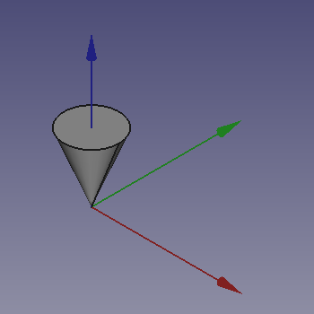
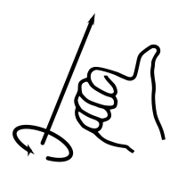
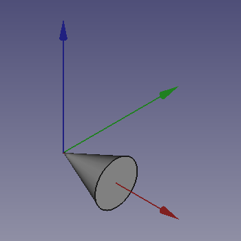
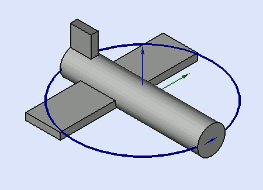

# FreeCAD Rotations

A guide on understanding how rotations work in FreeCAD.

Understanding a rotation about one axis is simple to understand.

This guide focuses on rotating about more than one axis.

## Prerequisites

Install [FreeCAD 19.2].

## Rotating About More Than One Axis

### Cone Instructions

1. Start FreeCAD.
2. Select **Part** workbench from workbench dropdown.

   [](https://wiki.freecadweb.org/Part_Module)

3. Click "*Create a cone solid*" button on toolbar.

   [](https://wiki.freecadweb.org/Part_Cone)

4. Set the `Radius1` property of the **Cone** to `0.00 mm`.
5. Select **View** > **Toggle axis cross** (`A`, `C`).
   * Red, Green, and Blue represents X, Y, and Z axes respectively.

   

7. With Cone selected, select **Edit** > **Placement** from the top main file menu.
9. Select "*Euler Angles (xy'z")*" from the dropdown under "*Rotation*".
   * Positive rotations are clockwise when viewed from the Origin along an axis — or counter-clockwise when viewed towards the Origin (see [Right-hand rule](https://en.wikipedia.org/wiki/Right-hand_rule)).

   

   * Also see, [explanation of xy'z" notation](https://en.wikipedia.org/wiki/Euler_angles#Conventions).
   * x-y'-z" (intrinsic rotations) or z-y-x (extrinsic rotations).
8. Enter 90° around x-axis.

   

9. and 90° around z-axis.

   

10. Click the **OK** button.
11. The `Angle` is **120°**, and `Axis` is (**0.58**, **0.58**, **0.58**).
   * But *how is this calcuated*?

### Euler Angles

[Euler angles] combine a series of rotations around X, Y, and Z axes into a *single* rotation about *one* axis.

A rotation about Z, Y, and X axes is also know as a rotation about **Y**aw, **P**itch, and **R**oll axes ([from aircraft axes]).

|Yaw (Z)|
|:-----:|
||

|Pitch (Y)|
|:-------:|
||

|Roll (X)|
|:------:|
||

> ***GIF Source:** [FreeCAD Wiki: Position and Yaw, Pitch and Roll].*

The order of multiplication is Yaw, Pitch, Roll.[¹][1]

Ensure **View** > **Panels** > **Python console** is checked.

We can calculate the `Angle` and `Axis` vector and using FreeCAD.

```python
>>> from FreeCAD import Rotation, Vector
>>> yaw = Rotation(Vector(0, 0, 1), 90)
>>> roll = Rotation(Vector(1, 0, 0), 90)
>>> rotation = yaw.multiply(roll)
>>> rotation.Axis
Vector (0.5773502691896258, 0.5773502691896256, 0.5773502691896258)
>>> from math import degrees
>>> degrees(rotation.Angle)
119.99999999999999
```

How does FreeCAD caculate this though?

### [Euler Angles] to [Axis–angle representation]

> The following formula doesn't work if the rotation matrix is symmetric! For example (-90, 0, 180) in (yaw, pitch, roll) or (z, y, x).

#### Three Elemental Rotation Matrices

`Yaw(θ)`
```
┌ cos(θ)  -sin(θ)  0 ┐
│ sin(θ)   cos(θ)  0 │
└ 0        0       1 ┘
```

`Pitch(θ)`
```
┌  cos(θ)  0  sin(θ) ┐
│  0       1  0      │
└ -sin(θ)  0  cos(θ) ┘
```

`Roll(θ)`
```
┌ 1  0        0      ┐
│ 0  cos(θ)  -sin(θ) │
└ 0  sin(θ)   cos(θ) ┘
```

---

Using these elemental rotation matrices, we substitute our angle for θ, for each corresponding axis.

`Yaw(90)`
```
┌ cos(90)  -sin(90)  0 ┐
│ sin(90)   cos(90)  0 │
└ 0        0         1 ┘
```

`Roll(90)`
```
┌ 1  0         0       ┐
│ 0  cos(90)  -sin(90) │
└ 0  sin(90)   cos(90) ┘
```

---

Then we evaluate `sin(90)` and `cos(90)`, which results in `1` and `0` respectively.

`Yaw(90)`
```
    0   -1    0
    1    0    0
    0    0    1
```

`Roll(90)`
```
    1    0    0
    0    0   -1
    0    1    0
```

---

Finally, we multiply `Yaw(90)` with `Roll(90)` using [Matrix multiplication] and [WolframAlpha](https://www.wolframalpha.com/input/?i=%7B%7B0%2C+-1%2C+0%7D%2C+%7B1%2C+0%2C+0%7D%2C+%7B0%2C+0%2C+1%7D%7D+%7B%7B1%2C+0%2C+0%7D%2C+%7B0%2C+0%2C+-1%7D%2C+%7B0%2C+1%2C+0%7D%7D) (*individual steps not shown*).

```
    0    0    1
    1    0    0
    0    1    0
```

We can verify these with a `print_matrix` function.
```python
from FreeCAD import Matrix

def print_matrix(matrix: Matrix, precision=2, width=5) -> None:
    translation_vector = [matrix.A14, matrix.A24, matrix.A34]
    has_translation = all(translation_vector)
    num_dimensions = 4 if has_translation else 3
    for i in range(1, num_dimensions + 1):
        for j in range(1, num_dimensions + 1):
            attr = 'A' + str(i) + str(j)
            # + 0 to format -0 as positive 0.
            value = round(getattr(matrix, attr), ndigits=precision) + 0
            print("{:>{width}}".format(value, width=width), end='')
        print()
```

```python
>>> print_matrix(yaw.toMatrix(), precision=None)
    0   -1    0
    1    0    0
    0    0    1
>>> print_matrix(roll.toMatrix(), precision=None)
    1    0    0
    0    0   -1
    0    1    0
>>> print_matrix(rotation.toMatrix(), precision=None)
    0    0    1
    1    0    0
    0    1    0
```

#### Angle

The `Angle`, `θ`, can be calcuated by using the following formula.[²][2]
```
θ = arccos(tr(R) - 1 / 2)
```
Where `R` is the `rotation` matrix above.

`tr(R)` means calculate the [trace] of `R` which is the sum of the elements on the main diagonal.
```
tr(R) = 0 + 0 + 0 = 0
```

Substituting `0` for `tr(R)` results in the following simplified formula.
```
θ = arccos(-1/2)
```

We can then use Python to calculate `theta` for us.
```python
>>> from math import degrees, acos
>>> theta = acos(-1/2)
>>> degrees(theta)
120.00000000000001
```

#### Axis
Where `R` is the `rotation` matrix above.
```
    ┌ R₁₁  R₁₂  R₁₃ ┐
R = │ R₂₁  R₂₂  R₂₃ │
    └ R₃₁  R₃₂  R₃₃ ┘
```

Substitute our values in.
```
    ┌ 0  0  1 ┐
R = │ 1  0  0 │
    └ 0  1  0 ┘
```

A vector `u` is computed using the following.
```
    ┌ R₃₂ - R₂₃ ┐
u = │ R₁₃ - R₃₁ │
    └ R₂₁ - R₁₂ ┘
```

Substitute our values in
```
    ┌ 1 - 0 ┐
u = │ 1 - 0 │
    └ 1 - 0 ┘
```

Complete the calculation.
```
    ┌ 1 ┐
u = │ 1 │
    └ 1 ┘
```

We then normalize the axis vector `u` from above to calculate the `Axis` vector.[²][2]
```
w = (1 / 2 * sin(θ)) * u
```

In python.
```python
>>> from math import sin, acos
>>> 1 / (2 * sin(theta))
0.5773502691896258
>>> u = Vector(1, 1, 1)
>>> 1 / (2 * sin(theta)) * u
Vector (0.5773502691896258, 0.5773502691896258, 0.5773502691896258)
```

## General Rotations

The following matrix product uses the following nomenclature:

* `1`, `2`, `3` subscripts represent the angles `α`, `β` and `γ` (i.e. the angles corresponding to the first, second and third elemental rotations respectively).
* `X`, `Y`, `Z` are the matrices representing the elemental rotations about the axes x, y, z (e.g. `Z₁` represents a rotation about z by an angle α).
* `s` and `c` represent **s**ine and **c**osine (e.g. `s₁` represents the sine of α).


```
         ┌ c₁c₂   c₁s₂s₃ - c₃s₁     s₁s₃   + c₁c₃s₂ ┐
Z₁Y₂X₃ = │ c₂s₁   c₁c₃   + s₁s₂s₃   c₃s₁s₂ - c₁s₃   │
         └ -s₂    c₂s₃              c₂c₃            ┘
```
**Sources:** *source*[¹][1] *source*[³][3]

## [Euler angles] to [Quaternion]

```python
from math import cos, radians, sin
from typing import Tuple


def euler_to_quaternion(yaw: float,
                        pitch: float,
                        roll: float) -> Tuple[float, float, float, float]:
    """
    Convert Euler angles (in degrees) to quaternion form:
        q0 = x, q1 = y, q2 = z and q3 = w
    where the quaternion is specified by q = w + xi + yj + zk.

    See:
        https://github.com/FreeCAD/FreeCAD/blob/0.19.2/src/Base/Rotation.cpp#L632-L658
        https://en.wikipedia.org/wiki/Quaternion
    """
    y = radians(yaw)
    p = radians(pitch)
    r = radians(roll)

    c1 = cos(y / 2.0)
    s1 = sin(y / 2.0)
    c2 = cos(p / 2.0)
    s2 = sin(p / 2.0)
    c3 = cos(r / 2.0)
    s3 = sin(r / 2.0)

    qx = (c1 * c2 * s3) - (s1 * s2 * c3)
    qy = (c1 * s2 * c3) + (s1 * c2 * s3)
    qz = (s1 * c2 * c3) - (c1 * s2 * s3)
    qw = (c1 * c2 * c3) + (s1 * s2 * s3)

    return (qx, qy, qz, qw)

```

```python
>>> euler_to_quaternion(-90, 0, 180)
(0.7071067811865476, -0.7071067811865475, -4.329780281177466e-17, 4.329780281177467e-17)
```

## [Quaternion] to [Axis–angle representation]

```python
from math import acos, degrees, sqrt
from typing import Tuple


def quaternion_to_axis_angle(quaternion: Tuple[float, float, float, float]) -> Tuple[Tuple[float, float, float], float]:
    """
    Convert quaternion to axis-angle form.

    Axis-angle is a two-element tuple where
    the first element is the axis vector (x, y, z),
    and the second element is the angle in degrees.

    See:
        https://github.com/FreeCAD/FreeCAD/blob/0.19.2/src/Base/Rotation.cpp#L119-L140
        https://www.euclideanspace.com/maths/geometry/rotations/conversions/quaternionToAngle/index.htm
    """
    qx, qy, qz, qw = quaternion

    s = sqrt(1 - qw**2)
    normalization_factor = 1 if s < 0.001 else s
    x = qx / normalization_factor
    y = qy / normalization_factor
    z = qz / normalization_factor
    axis = (x, y, z)

    angle = degrees(2 * acos(qw))

    return (axis, angle)

```

**Source:** https://www.euclideanspace.com/maths/geometry/rotations/conversions/quaternionToAngle/index.htm

## References

* [Rotation matrix]
* [Euler angles]
* [Axis–angle representation]
* [Quaternion]
* [Conversion between quaternions and Euler angles]
* [Symmetric matrix]

## Additional Resources

* [Rotation and the Right Hand Rule](https://www.youtube.com/watch?v=-EymCI1g5rs)
* [Why do we use 4x4 Matrices in Computer Graphics?](https://www.youtube.com/watch?v=Do_vEjd6gF0)
* [Euler Angles - Interactive 3D Graphics](https://www.youtube.com/watch?v=q0jgqeS_ACM)
* [Singularity in 3D rotation angle sequences](https://robotacademy.net.au/lesson/singularity-in-3d-rotation-angle-sequences/)


[Conversion between quaternions and Euler angles]: https://en.wikipedia.org/wiki/Conversion_between_quaternions_and_Euler_angles
[Quaternion]: https://en.wikipedia.org/wiki/Quaternion
[Symmetric matrix]: https://en.wikipedia.org/wiki/Symmetric_matrix
[FreeCAD 19.2]: https://github.com/FreeCAD/FreeCAD/releases/tag/0.19.2
[Euler angles]: https://en.wikipedia.org/wiki/Euler_angles
[from aircraft axes]: https://en.wikipedia.org/wiki/Aircraft_principal_axes
[FreeCAD Wiki: Position and Yaw, Pitch and Roll]: https://wiki.freecadweb.org/Placement#Position_and_Yaw.2C_Pitch_and_Roll
[1]: https://en.wikipedia.org/wiki/Euler_angles#Rotation_matrix
[Rotation matrix]: https://en.wikipedia.org/wiki/Rotation_matrix
[trace]: https://en.wikipedia.org/wiki/Trace_(linear_algebra)
[2]: https://en.wikipedia.org/wiki/Axis%E2%80%93angle_representation#Log_map_from_SO(3)_to_%7F'%22%60UNIQ--postMath-0000000D-QINU%60%22'%7F(3)
[3]: https://en.wikipedia.org/wiki/Rotation_matrix#General_rotations
[Axis–angle representation]: https://en.wikipedia.org/wiki/Axis%E2%80%93angle_representation
[Matrix multiplication]: https://en.wikipedia.org/wiki/Matrix_multiplication
