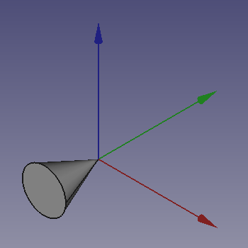

# FreeCAD Rotations

A guide on understanding how rotations work in FreeCAD.

Understanding a rotation about one axis is simple to understand.

This guide focuses on rotating about more than one axis.

## Prerequisites

Install [FreeCAD 19.2].

## Rotating About More Than One Axis

1. Start FreeCAD.
2. Select **Part** workbench from workbench dropdown.

   [](https://wiki.freecadweb.org/Part_Module)

3. Click "*Create a cone solid*" button on toolbar.

   [](https://wiki.freecadweb.org/Part_Cone)

4. Set the `Radius1` property of the **Cone** to `0.00 mm`.
5. Select **View** > **Toggle axis cross** (`A`, `C`).
   * Red, Green, and Blue represents X, Y, and Z axes respectively.

   

7. With Cone selected, select **Edit** > **Placement** from the top main file menu.
9. Select "*Euler Angles (xy'z'')*" from the dropdown under "*Rotation*".
8. Enter 90° around x-axis.

   

9. and 90° around z-axis.

   

10. Click the **OK** button.
11. The `Angle` is **120°**, and `Axis` is (**0.58**, **0.58**, **0.58**).
   * But *how is this calcuated*?

[Euler angles] combine a series of rotations around X, Y, and Z axes into a *single* rotation about *one* axis.

A rotation about Z, Y, and X axes is also know as a rotation about **Y**aw, **P**itch, and **R**oll axes ([from aircraft axes]).

|Yaw (Z)|
|:-----:|
||

|Pitch (Y)|
|:-------:|
||

|Roll (X)|
|:------:|
||

> ***GIF Source:** [FreeCAD Wiki: Position and Yaw, Pitch and Roll].*

The order of multiplication is Yaw, Pitch, Roll[¹][1].

Ensure **View** > **Panels** > **Python console** is checked.

We can calculate the `Angle` and `Axis` vector and using FreeCAD.

```python
>>> from FreeCAD import Rotation, Vector
>>> yaw = Rotation(Vector(0, 0, 1), 90)
>>> roll = Rotation(Vector(1, 0, 0), 90)
>>> rotation = yaw.multiply(roll)
>>> rotation.Axis
Vector (0.5773502691896258, 0.5773502691896256, 0.5773502691896258)
>>> from math import degrees
>>> degrees(rotation.Angle)
119.99999999999999
```

How does FreeCAD caculate this though?

*Three Elemental Rotation Matrices*

`Yaw(θ)`
```
┌ cos(θ)  -sin(θ)  0 ┐
│ sin(θ)   cos(θ)  0 │
└ 0        0       1 ┘
```

`Pitch(θ)`
```
┌  cos(θ)  0  sin(θ) ┐
│  0       1  0      │
└ -sin(θ)  0  cos(θ) ┘
```

`Roll(θ)`
```
┌ 1  0        0      ┐
│ 0  cos(θ)  -sin(θ) │
└ 0  sin(θ)   cos(θ) ┘
```

---

Using these elemental rotation matrices, we substitute our angle for θ, for each corresponding axis.

`Yaw(90)`
```
┌ cos(90)  -sin(90)  0 ┐
│ sin(90)   cos(90)  0 │
└ 0        0         1 ┘
```

`Roll(90)`
```
┌ 1  0         0       ┐
│ 0  cos(90)  -sin(90) │
└ 0  sin(90)   cos(90) ┘
```

---

Then we evaluate `sin(90)` and `cos(90)`, which results in `1` and `0` respectively.

`Yaw(90)`
```
┌ 0  -1  0 ┐
│ 1   0  0 │
└ 0   0  1 ┘
```

`Roll(90)`
```
┌ 1  0  0  ┐
│ 0  0  -1 │
└ 0  1   0 ┘
```

Finally, we multiply `Yaw(90)` with `Roll(90)` (*individual steps not shown*).

```
┌ 0  0  1 ┐
│ 1  0  0 │
└ 0  1  0 ┘
```

We can verify these with some convience functions.
```python
from FreeCAD import Matrix

def round_matrix(matrix: Matrix) -> Matrix:
    rounded_matrix = Matrix()
    num_dimensions = 4
    for i in range(1, num_dimensions + 1):
        for j in range(1, num_dimensions + 1):
            attr = 'A' + str(i) + str(j)
            value = getattr(matrix, attr)
            setattr(rounded_matrix, attr, round(value))
    return rounded_matrix

def print_matrix(m: Matrix):
    print("{:>5} {:>5} {:>5} {:>5}".format(m.A11, m.A12, m.A13, m.A14))
    print("{:>5} {:>5} {:>5} {:>5}".format(m.A21, m.A22, m.A23, m.A24))
    print("{:>5} {:>5} {:>5} {:>5}".format(m.A31, m.A32, m.A33, m.A34))
    print("{:>5} {:>5} {:>5} {:>5}".format(m.A41, m.A42, m.A43, m.A44))
```

```python
>>> print_matrix(round_matrix(yaw.toMatrix()))
  0.0  -1.0   0.0   0.0
  1.0   0.0   0.0   0.0
  0.0   0.0   1.0   0.0
  0.0   0.0   0.0   1.0
>>> print_matrix(round_matrix(roll.toMatrix()))
  1.0   0.0   0.0   0.0
  0.0   0.0  -1.0   0.0
  0.0   1.0   0.0   0.0
  0.0   0.0   0.0   1.0
>>> print_matrix(round_matrix(rotation.toMatrix()))
  0.0   0.0   1.0   0.0
  1.0   0.0   0.0   0.0
  0.0   1.0   0.0   0.0
  0.0   0.0   0.0   1.0
```

```
    ┌ a  b  c ┐
R = │ d  e  f │
    └ g  h  i ┘
```

```
    ┌ 0  0  1 ┐
R = │ 1  0  0 │
    └ 0  1  0 ┘
```

```
    ┌ h - f ┐
u = │ c - g │
    └ d - b ┘
```

```
    ┌ 1 - 0 ┐
u = │ 1 - 0 │
    └ 1 - 0 ┘
```
```
    ┌ 1 ┐
u = │ 1 │
    └ 1 ┘
```

```
θ = arccos(tr(R) - 1 / 2)
```

`tr(R)` means calculate the [trace] of `R` which is the sum of the elements on the main diagonal.
```
tr(R) = 0 + 0 + 0 = 0
```
```
θ = arccos(-1/2)
```

```python
>>> from math import degrees, acos
>>> theta = acos(-1/2)
>>> degrees(theta)
120.00000000000001
```

Normalize the axis vector `u` from above to calculate `w`[²][2].
```
w = (1 / 2 * sin(θ)) * u
```

```python
>>> from math import sin, acos
>>> 1 / (2 * sin(theta))
0.5773502691896258
>>> u = Vector(1, 1, 1)
>>> 1 / (2 * sin(theta)) * u
Vector (0.5773502691896258, 0.5773502691896258, 0.5773502691896258)
```

## References

* [Rotation matrix]
* [Euler angles]

[FreeCAD 19.2]: https://github.com/FreeCAD/FreeCAD/releases/tag/0.19.2
[Euler angles]: https://en.wikipedia.org/wiki/Euler_angles
[from aircraft axes]: https://en.wikipedia.org/wiki/Aircraft_principal_axes
[FreeCAD Wiki: Position and Yaw, Pitch and Roll]: https://wiki.freecadweb.org/Placement#Position_and_Yaw.2C_Pitch_and_Roll
[1]: https://en.wikipedia.org/wiki/Euler_angles#Rotation_matrix
[Rotation matrix]: https://en.wikipedia.org/wiki/Rotation_matrix
[trace]: https://en.wikipedia.org/wiki/Trace_(linear_algebra)
[2]: https://en.wikipedia.org/wiki/Axis%E2%80%93angle_representation#Log_map_from_SO(3)_to_%7F'%22%60UNIQ--postMath-0000000D-QINU%60%22'%7F(3)